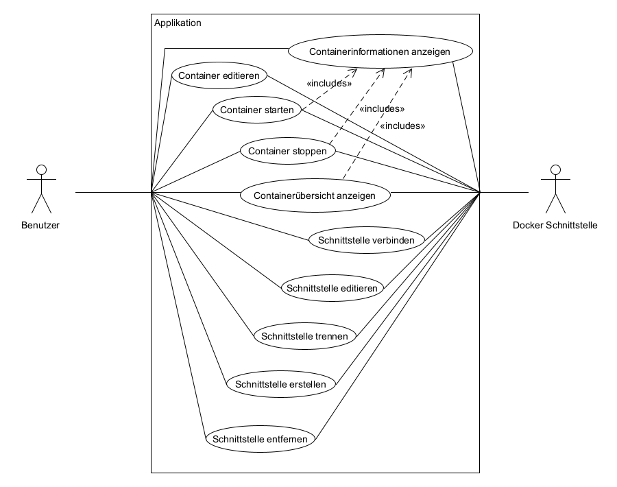
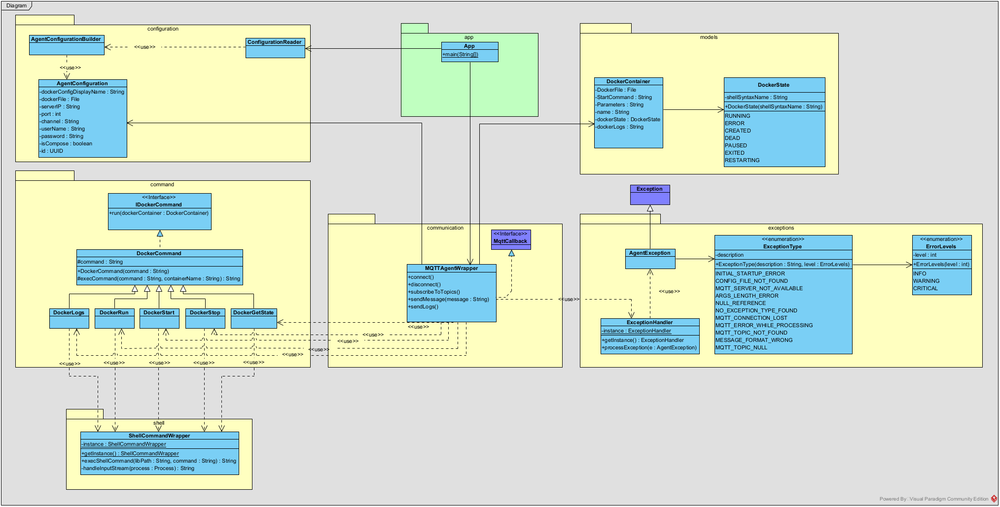
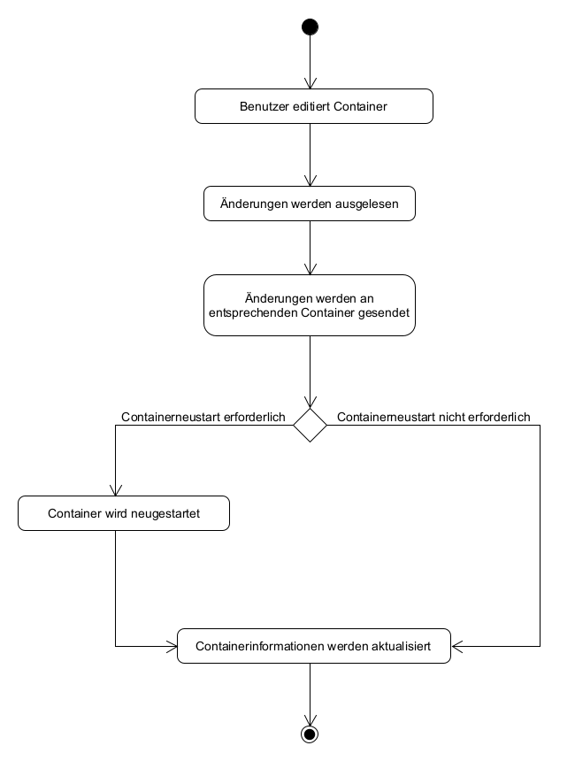

# Software Architecture Document (SAD)

## 1. Introduction
Dieser Abschnitt enthält grundlegende Informationen über die BabyPort-Software.

### 1.1 Purpose 

Dieses Dokument, das Software Architecture Document, kurz SAD, dient dazu, die Architektur unserer Anwendung ``BabyPort`` zu dokumentieren. Dabei soll es Entwicklern, aber auch anderen Personen wie  Produktownern, einen Einblick in die Struktur der Software ``BabyPort`` geben.

### 1.2 Scope 

Dieses Dokument befasst sich mit der gesamten Architektur der Software und soll einen detaillierten Überblick geben. Fehler, die noch nicht bemerkt wurden, können entdeckt und dadurch behoben werden. Gleichzeitig bringt es alle Teammitglieder auf den gleichen Stand und fasst alle Erkenntnisse in einem Dokument zusammen, sodass jedes Teammitglied sofort darauf zugreifen kann und ein Konsens geschaffen wird.

### 1.3 Definition, Acronyms und Abbreviations
- **UML:** _Unified modeling language_
- **MVC:** _Model-View-Controller_
- **MQTT:** _Message Queuing Telemetry Transport_
- **KISS:** _Keep it simple stupid_
- **DRY:** _Don't repeat your self_
- **SOLID:** 
    - _S – Single-Responsibility-Prinzip_
    - _O – Open-Closed-Prinzip_
    - _L – Liskovsches Substitutionsprinzip_
    - _I – Interface-Segregation-Prinzip_
    - _D – Dependency-Inversion-Prinzip_
- **CI:** _Continous Integration_
- **CI/CD:** _Continous integration, Continous delivery_
- **GUI:** _Graphical user interface_
- **UI:** _User interface_
- **SRS:** _Software requirments specification_
- **SAD:** _Software architecture document_
- **ASR:** _Architectural significat requirement_
- **UCRS:** _Use-Case realisiation specification_
- **CRUD:** _CREATE, REMOVE, UPDATE, DELETE_

### 1.4 References
- [SRS](./Software%20Requirements%20Specification%20(SRS).md)
- [ASR](./Architecturally%20Significant%20Requirement%20(ASR).md)
- [UCRS (StartContainer)](./UCRS_StartContainer.md)
- [UCRS (StopContainer)](./UCRS_StopContainer.md)
- [Code style decisions](./codeStyleDecisions.md)

## 2. Architectural Representation
In diesem Abschnitt werden verschiedene Architekturentscheidungen bezüglich Client-Server und Agent dokumentiert.

### 2.1 Client-Server Architektur
Die einzelnen Software-Teile des Server-Clients wurden in Komponenten unterteilt und diese Komponenten dann in einzelnen Packages zusammengefasst. Die Hauptarchitektur des Softwareentwurfs umfasst die `MVC (Model-View-Controller)` Architektur. Die Wahl `MVC` zu verwenden hat den Hauptgrund, da wir durch die Trennung von Model, View und Controller eine künstliche Abstraktionsebene schaffen, in der wir die `MQTT-Clients/Kommunikation` einfach integrieren können, ohne die Softwarearchitektur negativ zu beeinflussen.

### 2.2 Agent Architektur
Ferner wurde der Agent als Sidecar implementiert. Da wir nicht nur eine Hauptapplikation besitzen, benötigen wir eine weitere Komponente, den Agent, womit ein Zugriff auf das Betriebssystem unabhängig auf andere Geräte möglich wird. Daher haben wir das Sidecar Pattern gewählt, da dieses in der Industrie (Kubernetes Sidecar Container / Jenkins Build Prozessor Agents) für genau diesen Zweck Anwendung findet.

### 2.3 Design Patterns
Außerdem werden verschiedene Design-Patterns ``(wie z.B. Builder, Factory, Singleton)`` verwendet, um Code zu entkoppeln, eine klare Struktur zu implementieren und die Wartbarkeit zu gewährleisten.

Die Hauptkommunikation zwischen den Komponenten besteht aus einem ``Observer-Pattern``, welches eigene Events erstellen, empfangen und versenden kann.

Aus dieser Modellierung ergibt sich, dass wir insbesondere die folgenden **SOLID-Prinzipien** einhalten.

- **Interface-Segregation-Prinzip:** Alle Funktionalitäten, die dazu dienen, zwischen Komponenten zu kommunizieren, wurden in viele kleine Interfaces oder andere Abstraktion-Konstrukte unterteilt, um so viele Abhängigkeiten wie möglich zu vermeiden.
- **Single-Responsibility-Prinzip:** Beim Entwurf wurde besonders darauf geachtet, dass eine Klasse nur einen Abhängig zu einer anderen besitzt, um eine Clean-Code-Architektur zu erzielen. 

Außerdem haben wir uns vorgenommen, weitere Prinzipien wie **KISS** und **DRY** zu verwenden, um eine bessere Lesbarkeit, Wartbarkeit sowie Erweiterbarkeit in der Zukunft zu gewährleisten.

## 3. Architectural Goals and Constraints
Die Software `BabyPort` dient als Container-Management-System zur Verwaltung und Überwachung von Docker-Containern. `BabyPort` erreicht dies durch eine grafische Benutzeroberfläche, die verschiedene administrative Funktionen auf Docker Container abbildet.

### 3.1 Requirements
1. **Containerverwaltung:** Dieses System verwaltet Container mithilfe einer Systemschnittstelle. Diese Schnittstelle wird vom Hauptsystem per `MQTT` angesteuert. Mit Hilfe dessen können verschiedene Container zur Überwachung hinzugefügt, entfernt, gestartet, gestoppt oder bearbeitet werden.
2. **Statusinformationen von Containern:** Hierbei werden die Daten aufbereitet und zum Monitoring dargestellt.

### 3.2 Goals (Server-Client)
- **Planung Architektur Server-Client**
- **Erstellung einer benutzerfreundlichen UI**
- **Personalisierung der UI** (Propertymanager)
- **Event-Handling zwischen MQTT und Controller**
- **Event-Handling zwischen Controller und UI**
- **MQTT Kommunikation von Server-Client zu Agent**

### 3.3 Goals (Agent)
- **Planung Architektur Agent**
- **Operationen auf Docker Container** (CRUD)
- **Wrapping von Docker Commands**
- **Zeitgesteuerter Log Transfer**
- **Eigenes Exception Handling**
- **Konfiguration as Code**
- **MQTT Kommunikation von Agent zu Server-Client**

### 3.4 Importance of the goals for architectural decisions
Die `MVC-Architektur` wurde gewählt, da der Server-Client viel Funktionalität abbilden muss. Das heißt, das Server-Client handelt die UI, die `MQTT-Kommunikation` und die Modellierung der Daten. Daher bietet sich die `MVC-Architektur` an, weil sie eine Trennung zwischen Controller, UI und Models bietet und gleichzeitig keine Constraints aufbaut, bzgl. des Updates der Komponenten. 

Durch die Notwendigkeit, viele Events zwischen unabhänigen Kompoenten verwalten zu müssen, war es von großer Bedeutung, ein Design-Pattern zu wählen, welches diese Tätigkeit unterstüzt. Daher wird das `Observer-Pattern`, aufgrund seiner Listing Eigenschaften für das Event-Handling eingesetzt.

Der Agent nutzt das `Command Pattern` um eine einfache Erweiterbarkeit zu gewährleisten, da der Agent Docker Commands wrappen muss.

## 4. Use-Case View
In diesem Abschnitt werden die verschiedenen Anwendungsfälle dargestellt. Abschnitt 3.4 erläutert die Gründe für die Architekturentscheidungen, die auf der Grundlage der Use Cases getroffen wurden.

### 4.1 Use-Case Realizations
Der Fokus dieser Implementierungsphase lag auf der Container Interaktion. Damit sind alle `CRUD-Operationen`, welche in dem Use Case Diagramm abgebildet sind, gemeint. Dabei lag ein großer Teil der Implementierung auf Seiten der UI. Zudem wurde an der Schnittstelle gearbeitet. Für die korrekte Umsetzung aller Use Cases ist jedoch eine Verbindung zwischen der Hauptapplikation und dem Agent erforderlich. Diese wurde zu großen Teilen fertiggestellt.

>
  *4.1.1 UseCase-Diagramm*

## 5. Logical View 
In diesem Abschnitt werden die wichtigsten Klassen erläutert und ein Überblick über die Struktur der Software in absteigender Reihenfolge gegeben.

>Reihenfolge: **Applikation &rarr; Subsysteme &rarr; Packages &rarr; Klassen &rarr; wichtige Methoden und Attribute**.

### 5.1 Overview
Als Übersicht über alle Klassen folgen die beiden Klassendiagramme unserer beiden Subsysteme (Server-Client, Agent):

> 
 *5.1.1 Klassendiagramm des Server-Clients*

> 
  *5.1.2 Klassendiagramm des Agents*

### 5.2 Architecturally Significant Design Packages
In diesem Abschnitt wird erklärt, welche Aufgaben die Packages und relevanten Klassen haben.

### 5.2.1 Server-Client (Packages)
|  Package  | Erklärung |
|:---|:---|
| **App** | Enthält Einstiegspunkt der Software |
| **Model** | Enthält die Darstellung/Definierung der Datenschicht |
| **Controller** | Enthält die Klassen für das Event-Handling |
| **Ui** | Enthält alle Klassen, die dem Nutzer präsentiert werden |
| **Util** | Enthält Helfer-Klassen, zum Auslagern von Logik |
| **Communication** | Enthält die `MQTT-Schnittstellen` |
| **Event** | Enthält die notwendigen Klassen für das `Observer-Pattern` für Events |
| **Abstraction** | Enthält die Datenabstraktionsebene von Modell zu UI |

### 5.2.2 Agent (Packages)
|  Package  | Erklärung |
|:---|:---|
| **App** | Enthält Einstiegspunkt der Software |
| **Command** | Enthält die Abstraktionslogik für die Docker Commands |
| **Configuration** | Enthält die Konfiguration des Agents |
| **Communication** | Enthält die `MQTT-Schnittstelle` |
| **Exceptions** | Enthält die notwendigen Klassen bzgl. des ExceptionHandlings |
| **Models** | Enthält die Darstellung/Definierung der Datenschicht  |
| **Shell** | Enthält die Zugriffsebene auf die Shell des Hosts |

### 5.2.3 Server-Client (Classes)
Wichtigste Klassen für die Funktionalität des Server-Clients:

|  Package  | Erklärung | wichtige Methoden | wichtige Attribute |
|:---|:---|:---|:---|
| **MainUi.class** | Die `MainUi` fungiert als Event-Router, um alle möglichen Ui-Events der Subkomponenten zu bündeln und diese dann an den Controller zu versenden. | `initUi(): void` |  `selectedValue: IDisplayable` |
| **Controller.class** | Ist die Hauptkomponenten welche die Logik abbildet, um das Routing zwischen den einzelnen Klassen zu ermöglichen. | `processGUIEvent(e: GUIEvent): void` | `entityManager: ClientWrapperManager` |
| **MQTTClientWrapper.class** | Handelt die `MQTT-Kommunikation` zwischen Server-Client und Agent und benachritigt den Controller bei Events. | `messageArrived(topic: String, mqttMessage: MqttMessage): void` | `systemAccessPoint: SystemAccessPoint`; `dockerContainer: DockerContainer`|

### 5.2.4 Agent (Classes)
Wichtigste Klassen für die Funktionalität des Agents:

|  Package  | Erklärung | wichtige Methoden | wichtige Attribute |
|:---|:---|:---|:---|
| **ConfigurationReader.class** | Da der Agent ohne GUI genutzt werden soll, können alle Parameter übergeben oder per Datei gesetzt werden. | `parseConfig(): void` | `configFilePath: String` |
| **DockerCommand.class** | Bildet einen Docker Command in der Shell ab, sodass dieser in Java genutzt werden kann. | `run(): void` | `command: String` |
| **MQTTAgentWrapper.class** | Handled die `MQTT-Kommunikation` zwischen Server-Client und Agent und verschickt die angeforderten Informationen bzgl. der Container | `messageArrived(topic: String, mqttMessage: MqttMessage): void` | `agentConfiguration: AgentConfiguration` |

### 5.3 Relationships
Alle Beziehungen / Zugriffe zwischen Klassen, Packages und Componenten können aus dem UML-Klassendiagrammen entnommen werden. _(Siehe 5.1 Overview)_

## 6. Process View
In diesem Abschnitt wird erläutert, welche Prozesse in der Software ablaufen und welche Klassen für die Prozesse verantwortlich sind.

>
 *6.0.1 Sequenzdiagramm für BabyPort (Server-Client)*

### 6.1 Process-Groups for Server-Client

| Prozess-Gruppe | Verantworlichkeit | Involvierte Klassen |
| :--- | :---| :---:|
| **Observer-Pattern** | Struktur und Hierachie der Eventkommunikation vorgeben und verwalten | Event-Package |
| **MQTT-Kommunikation** | Kommunikation zwischen Sidecar und Hauptapplikation | Communication-Package, `MQTTMessage.class` |
| **UI-LookandFeel** | Handeln von benutzerdefinierten Einstellung der UI | `UiPropertyManager.class`, `MainGui.class`, `App.class` |

### 6.2 Process-Groups for Server-Client

| Prozess-Gruppe | Verantworlichkeit | Involvierte Klassen |
| :--- | :---| :---:|
| **Erstellung DockerCommand** | Erzeugen der DockerCommand Objekte, welche selbst die Kommandozeilen-Kommandos umschließen. | Command-Package, `ShellCommandWrapper.class` |
| **MQTT-Kommunikation** | Kommunikation zwischen Sidecar und Hauptapplikation | Communication-Package, `MQTTMessage.class` |
| **Laden der Konfiguration** | Laden der Konfiguration aus Kommandozeilenargumenten oder aus einer Datei | Configuration-Package, `App.class` |

### 6.3 Process View from the User Perspective
Hier sind die wichtigsten Operationen auf Container aufgelistet, bzgl. dessen, wie ein User mit dem Container interagiert und wie der Prozess aus Nutzerperspektive aussieht.

> 
 *6.3.1 Aktiviätsdiagramm für das Starten von Docker Containern*

> 
 *6.3.2 Aktiviätsdiagramm für das Editieren von Docker Containern*

> 
 *6.3.3 Aktiviätsdiagramm für das Stoppen von Docker Containern*

## 7. Deployment View
In diesem Abschnitt wird erklärt, wie die Software zu installieren ist und welche Voraussetzungen für einen erfolgreichen Betrieb der Software `BabyPort` erfüllt sein müssen.

### 7.1 Hardware Deployment
Die Server-Client-Software wird auf einem lokalen Computer des Benutzers ausgeführt. Der Agent kann **1:n**-mal auf verschiedene virtuellen oder physikalischen Servern ausgeführt werden, um dort eine große Menge von Docker Containern zu steuern. Ferner wird der Agent als Service konfiguriert, sodass er sich automatisch beim Starten und Herunterfahren der einzelnen Nodes (Hardware oder Software) auch mit startet oder stoppt. Zusätzlich bietet dieses Deployment die Möglichkeit, dass der Service bei einem Crash automatisch wieder hochgefahren wird.

Des Weiteren muss ein MQTT-Broker auf einem Server an einem zentralen Ort installiert werden, um die Kommunikation zwischen Server-Client und Agent zu gewährleisten.

### 7.2 Network
Beide Komponenten benötigen einen uneingeschränkten Zugang zu MQTT-Broker. Das bedeutet, dass der MQTT-Broker entweder aus dem Internet erreichbar sein muss und beide Komponeten Zugang zum Internet haben müssen oder dass es Routings geben muss, welche eine Kommunikation beider Komponenten zum MQTT-Broker ermöglicht.

## 8. Implementation 
In diesem Abschnitt wird erläutert, wie die hierarchischen Schichten der Software strukturiert sind und welche Softwarewerkzeuge und Plattformen für die Implementierung verwendet wurden.

### 8.1 Layers
Im Folgenden ist eine Hierarchie der einzelnen Komponenten und Subkomponeten aufgelistet, anhand ihrer Relevanz für die Use-Cases:

```mermaid
graph LR;
    id1[GUI]-->id2[Observer];
    id2[Observer]-->id3[MQTT-Kommunikation]
    id3[MQTT-Schnittstelle]-- Schnittstelle zwischen Agent und Client (MQTT-Broker) ---id6[MQTT-Schnittstelle]
    id6[MQTT-Schnittstelle]-->id4[Agent]
    id4[Agent]-->id5[DockerCommand]
    id5[DockerCommand]-->id7[Shell]
```
Wie im Diagramm zu sehen ist, folgen daraus die Layers unsere Applikation:
1. **GUI** (Server-Client)
2. **Observer** (Server-Client)
3. **MQTT-Schnittstelle** (Server-Client)
4. **MQTT-Broker**
5. **MQTT-Schnittstelle** (Agent)
6. **Docker-Command** (Agent)
7. **Shell** (Docker Binary von Linux/Windows) (Agent)

### 8.2 Software Tools
- **Java** (Sprache)
- **Java Swing** (UI-Framework)
- **JUnit 5** (Unit Tests)
- **Docker** (Engine und Docker CLI)
- **MQTT** (Kommunikation Standard)
- **SonarLint** (Linter für Entwicklungsumgebung)
- **Mockito** (Mock-Testing Framework)
- **Maven** (Dependency Management + Building)
- **Jetbrains IntelliJ Ultimate** (Entwicklungsumgebung)
- **Eclipse** (Entwicklungsumgebung)
- **Figma** (UI-Mockup)
- **Visual Paradigm** (UML-Diagramm Editor)
- **UMLet** (UML-Diagramm Editor)

### 8.3 Plattform
- **Ubuntu Server** (MQTT-Broker und Agent)
- **Desktop Environment** (Linux, MacOS, Windows)
- **SonarQube** (statische Code-Analyse)
    - _CheckStyle von Google (für Java)_
    - _Quality Gate Settings entsprechen Abgabebedingungen_
- **Jenkins** (CI/CD)
- **GitLab** (Source-Code-Control)
- **Jira** (Projektmanagement + Zeiterfassung)
- **Medium** (Blog Posting Platform)
- **GitHub** (Plattform für Dokumente Veröffentlichungen)

## 9. Size and Performance
Dieser Abschnitt enthält relevante Informationen über die Leistung der Anwendung, bereinigt um Systemspezifika und die Auswirkungen von Architekturentscheidungen auf die Größe der Anwendung.

### 9.1 Performance & Availability
Durch die `MVC-Architektur` und das Design Pattern `Observer`, lassen sich bzgl. des Event-Handlings Latenzzeit von unter einer Sekunde in 95 Prozent aller Fälle erreichen. Zusätzlich dazu besteht die Möglichkeit, maximal 2¹⁶ Container gleichzeitig zu überwachen.

Darüber hinaus stellt die Verfügbarkeit aus Anwendersicht einen Mehrwert im Rahmen der Performance dar, da durch die definierte Inbetriebnahme des Agenten ein Neustart innerhalb von 30 Sekunden gewährleistet ist. Somit kann mit einer Verfügbarkeit von 80% gerechnet werden.

### 9.2 Size
Die Architekturentscheidungen `MVC`, `Sidecar` und `Observer-Pattern` sorgen dafür, dass sich die Klassenmenge sowie das Abstraktionniveau deutlich erhöht. Gleichwohl sorgen diese Entscheidungen dafür, dass eine Erweiterbarkeit sowie Wartbarkeit überhaupt gewährleistet sein kann. Daher sind diese Entscheidungen bzgl. der Größe des Projekts zu verantworten. Zusätzlich zur Erhöhung der Größe sowie des Abstraktionsniveaus ändert sich durch die Architekturentscheidungen aber nichts an der Performance der Software.

Es folgt daraus, dass die Vorteile der Architekturentscheidungen den Nachteilen bzgl. der Größe und Abstraktionniveaus überwiegen.

## 10. Quality
In diesem Abschnitt wird erläutert, welche Qualitätsziele festgelegt wurden und wie diese erreicht werden sollen.

### 10.1 Quality Goals
- **Nutzung von CI/CD** (Jenkins)
- **Nutzung von statischer Code-Analyse** (SonarQube)
- **Deployment innerhalb einer Sandbox-Umgebung**
- **Unit Tests**
- **Integration Tests**
- **End to End Tests**

### 10.2 Quality attributes
Aus den verschiedenen Architekturentscheidungen ergeben sich folgende Qualitätsattribute:

|  Quality attribute  | Refinement  | Quality attribute scenarios   | Business value   | Technical risk  |
|---|---|---|:---:|:---:|
| **Performance** |  Latenzzeit | Unter normalen Bedingungen benötigt ein Update des Container States < 1,0 Sekunden in 95% der Fälle.  | M  | M  |
|  | Durchsatz |Sind alle Container im State „running“, so können 2¹⁶ gleichzeitig überwacht werden. | M  |  H |
| **Availability**  | Hardware  |  Stürzt eine Agent-Instanz ab, wird das System in < 30 Sekunden normale Operationen fortsetzen. | H  | M  |
|  | Ausfallzeiten |Die Verfügbarkeit des Systems beträgt 80%.  | H  | H  |
| **Usability** |  System bietet ausreichende Funktionalität | Alle gängigen Funktionalitäten sind vorhanden, es besteht keine Notwendigkeit weitere Systeme zu nutzen.  | H  | M  |
| | Intuitivität | Durch das übersichtliche und userfreundliche Design ist es dem Nutzer möglich ohne Einführung diese Applikation zu verwenden.  | M  | H  |
| **Maintainability** | Code Quality | Sobald eine Codeänderung in der Repository gepusht wird, triggert diese eine Jenkins-Pipeline mit statischer Codeanalyse. Zudem analysiert dabei SonarQube den Code, sodass im Nachgang die aufgezeigten Fehler korrigiert werden können, um die festgelegte Codequalität zu gewährleisten.  | H | H |
| **Testability** | Testabdeckung | Um viele Bugs zu finden, bevor sie auftauchen, gilt es eine hohe, aber auch sinnvolle Testabdeckung zu gewährleisten. Dafür wird diese direkt in Sonarqube mit getrackt. Zudem gehört zu den Einstellungen im Quality Gate, dass eine Testabdeckung von mindestens 80% vorliegen muss. | M | L | 

### 10.3 Guarantee of Quality Attributes
Um die Qualitätsattribute zu gewährleisten, wird unsere Software kontinuierlich getestet. 
Dies wird durch eine `CI/CD - Pipeline` durchgeführt, welche den Code in folgenden Schritten testet.

1. _Git-Checkout_
2. _Unit-Tests_
3. _Integration-Tests_
4. _Packaging der Software_
5. _Statische Code Analyse mit SonarQube_
6. _Deployment in Sandbox_

Durch die Unit- und Integration-Tests sorgen wir dafür, dass Fehler, die durch Code-Änderungen passieren, möglichst effektiv und genau gefunden werden, sodass fehlerhafter Code nicht in Produktion gelangt. Ferner nutzen wir statische Codeanalyse mittels `SonarQube` um einen einheitlichen Qualitätsstandard unserer Software zu garantieren. 

Dies erreichen wir mittels eines Quality Gates welches, die folgenden Parameter prüft:

| Metrik | Operator  | Wert |
|:---:|:---:|:---:|
| **Code-Überdeckung** | größer als | 80% |
| **Duplizierter Code** | kleiner als | 3% |
| **Zuverlässigkeits Rating** | gleich | 0 erkannte Bugs |
| **Security Rating** | gleich | 0 erkannte Schwachstellen |