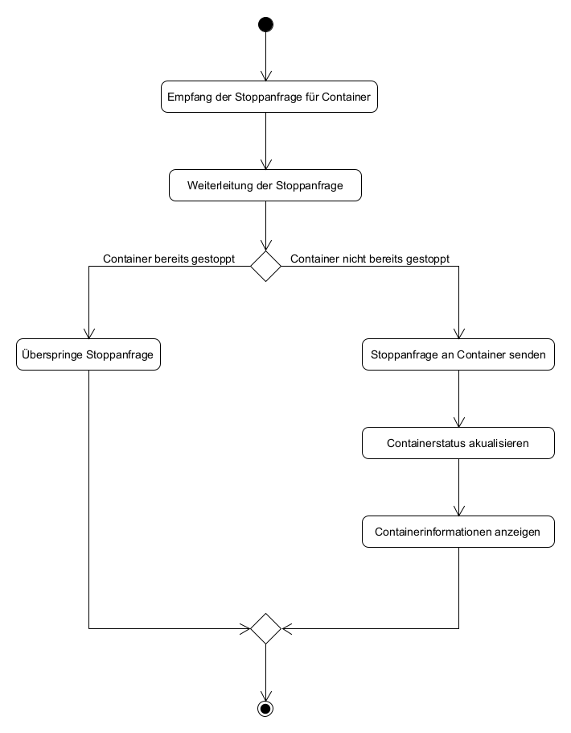

# Inhaltsverzeichnis

# 1. Einführung
Diese Software Requirements Specification (SRS) erfasst die Softwareanforderungen für die Anwendung "BabyPort". Sie enthält einen Überblick über das Projekt, dessen Vision und detaillierte Informationen über die geplanten Use-Cases.

## 1.1 Zweck der Software
Es soll eine Java Applikation mit zwei Komponenten erstellt werden. Eine Komponente (Desktop-Applikation) soll auf dem Computer des Users gestart werden, sodass diese Komponente Informationen von Agents, die zweite Komponente, erhalten können, welche auf Servern deployed werden und zum Event Übermittlung zwischen Server und Client fungieren sollen.

## 1.2 Scope
Die geplante Funktionalität beinhaltet:
- Containerverwaltung: Dieses System verwaltet Container mithilfe einer Systemschnittstelle. Diese Schnittstelle wird vom Hauptsystem per MQTT angesteuert. Mit Hilfe dessen können verschiedene Container zur Überwachung hinzugefügt, entfernt, gestartet, gestoppt oder bearbeitet.
- Statusinformationen von Containern: Hierbei werden die Daten aufbereitet und zum Monitoring dargestellt.

# 2. Gesamtbeschreibung der Software

## 2.1 Vision

Die Software BabyPort dient als Container Management System, zur Administration und Überwachung von Docker Containern. BabyPort erreicht das mittels einer GUI die verschiedene administrative Funktionen auf Docker Container abbildet.

## 2.2 Use Case Diagramm

## 2.3 GUI-Mockup

## 2.4 Ablauf von Events (Sequenzdiagram)

## 2.5 Technolgie Stack

Backend:
- Java

Frontend:
- Java Swing

IDE:
- IntelliJ Ultimate
- Eclipse

Projektmanagement:
- Jira (Atlassian)
- Medium

Deployment:
- Docker
- Jenkins

Testing:
- JUnit
- SonarQube

# 3. Spezifische Anforderungen

## 3.1 Funktionale Anforderungen

Diese Sektion wird die verschiedenen Use Cases, welche in dem Use Case Diagram dargestellt sind, behandeln und deren Funktionalität beschreiben.

### 3.1.1 Container starten
Um Docker Container zum laufen zu bringen muss der Benutzer in der Lage sein diese zu starten. Zum einen ist es möglich seperate einzelne Docker Container zu starten, aber auch durch Docker Compose mehrere gleichzeitig.

Aktivitätsdiagram:

### 3.1.2 Container stoppen
Damit Docker Container nicht dauerhaft, auch wenn diese nicht verwendet werden, im Betrieb sind, soll der Benutzer diese stoppen können.

Aktivitätsdiagram:

### 3.1.3 Container editieren
Damit der Benutzer die Konfigurationen der Docker Container anpassen kann, soll die Funktion der Editierung von Containern bereitgestellt werden.

Aktivitätsdiagram:

### 3.1.4 Containerinformationen anzeigen
Damit der Benutzer seine Docker Container überwachen kann, soll es möglich sein, deren Logs und weitere Informationen über diese, anzuzeigen. Dies ist ebenfalls für Fehlerbehandlung sehr relevant, falls bei dem Containerstart oder während dem laufendem Betrieb ein Fehler unterlaufen ist.

### 3.1.5 Containerübersicht anzeigen
Um einen allgemeinen Überblick über alle userspezifischen Docker Container zu erhalten, soll dies anhand einer Gesamtübersicht bereitgestellt werden.

### 3.1.6 Schnittstelle verbinden
Damit der Benutzer mit den Docker Containern kommunizieren kann, soll es diesem möglich sein, sich mit einer dafür vorgesehenen Schnittstelle zu verbinden.

### 3.1.7 Schnittstelle editieren
Des weiteren soll es dem Benutzer bereitgestellt werden Änderungen an der Schnittstelle vorzunehmen, weil zum Beispiel den Port zu ändern.

### 3.1.8 Schnittstelle trennen
Damit die Verbindung von der Schnittstelle zu den Docker Containern nicht dauerhaft aktiv ist, soll der Benutzer diese trennen können

### 3.1.9 Schnittstelle erstellen
Damit der Benutzer mit den Docker Containern kommunizieren kann, soll es diesem möglich sein, eine Schnittstelle für die Kommunikation zu erstellen.

### 3.1.10 Schnittstelle entfernen
Außerdem soll der Benutzer eine Schnittstelle entfernen können, wenn diese nicht weiter benötigt wird.

# 4. Unterstützende Informationen

| BabyPort                            | Version 1.0      |
| ----------------------------------- | ---------------- |
| Software Requirements Specification | Date: 28/10/2023 |

