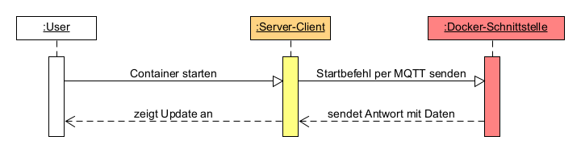
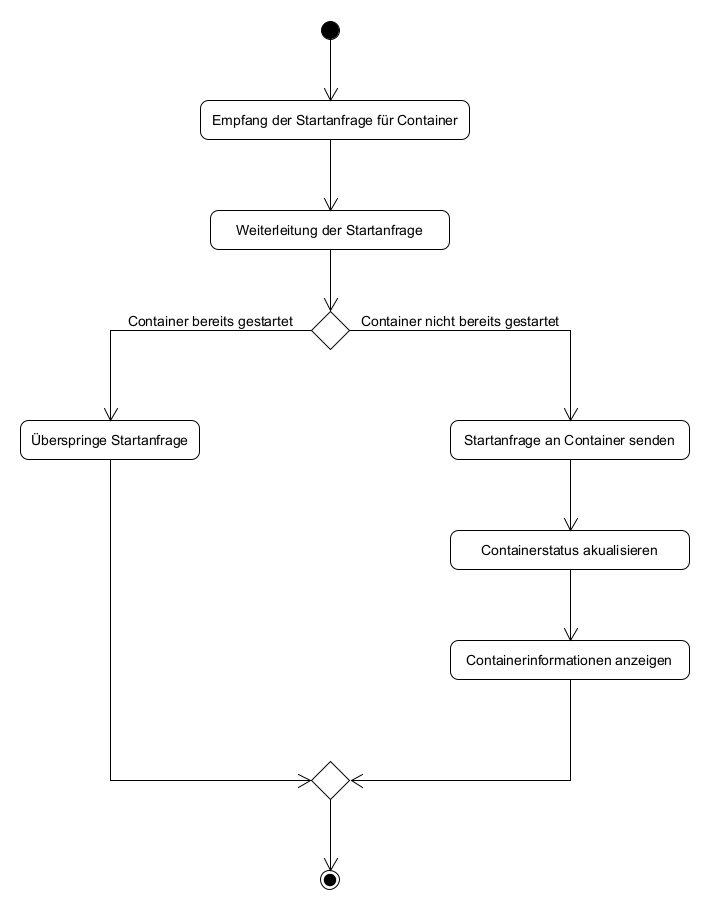

# Use-Case-Realization Specification (StartContainer)

# 1. Einleitung

## 1.1 Zweck
Der Use-Case sorgt dafür das Nutzer auf verschiedenen lokalen und entfernten Systemen einen Container starten können.

## 1.2 Scope
Dieses UCRS Dokument behandelt den Use-Case "Container-Starten"
Use-Case: Um Docker Container zum laufen zu bringen muss der Benutzer in der Lage sein diese zu starten. Zum einen ist es möglich seperate einzelne Docker Container zu starten, aber auch durch Docker Compose mehrere gleichzeitig.

## 1.3 References
- Aktivitätsdiagramm - (ActivityDiagram_StartContainer, 01/11/2023)
- Sequenzdiagramm - (Sequenzdiagramm_StartContainer, 01/11/2023)

## 1.4 Übersicht
Dieses Dokument enthält den Scope und Zweck des Use-Cases, sowie die Abfolge aller Events bis ein Container gestartet worden ist. Zusätzlich dazu wird noch ein Aktivitätsdiagramm und eine Alternativer Eventfluss angegeben.

# 2. Ablauf der Ereignisse - Entwurf

## 2.1 Textuelle Beschreibung
- Nutzer gibt den Befehl zum Starten eines Containers an das Server-Client
- Transfer der Startanfrage zur Docker-Schnittstelle (Agent) mittels MQTT
- Containerstatus wird von Docker-Schnittstelle (Agent) an das Server-Client zurückgemeldet
- Das Server-Client zeigt dem Nutzer die neuen Daten an.
## 2.2 Sequenzdiagramme

## 2.3 Aktivitätsdiagramm

## 2.4 Alternativer Eventfluss
- Sollte der Container schon bereits gestartet sein, wird die Startanfrageprocedure übersprungen.
 
