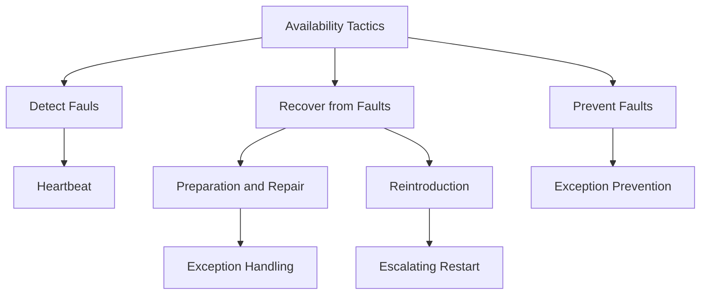
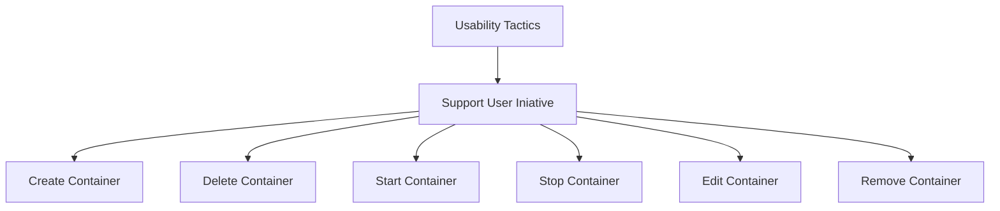
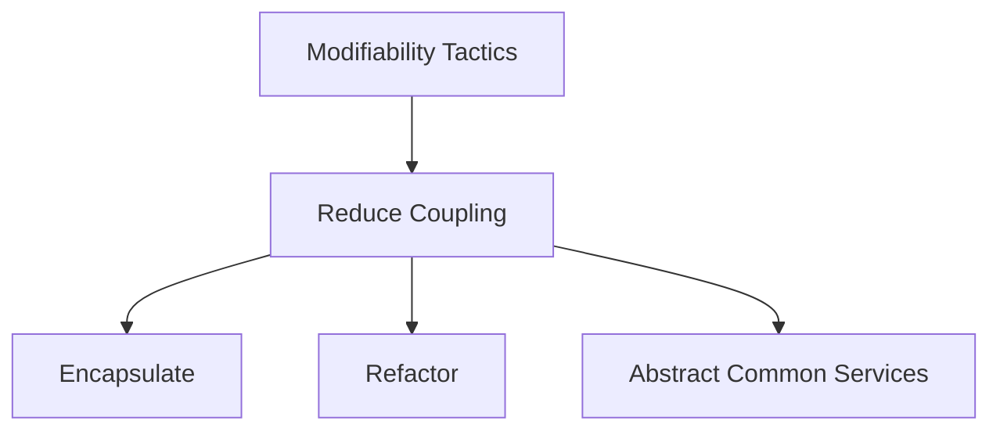

# Architecture Significant Requirements (ASR)
Die Architecture Significant Requirements (ASR) wurden auf der Grundlage des 3-Schritte-Ansatzes ermittelt. 

Im ersten Schritt wurden die Szenarien mit Hilfe der *6-Part-Form* fertgelegt welche als Leitfanden für den Utitlity Tree benutzt werden. Am Anschluss im zweiten Schritt wurde auf Basis der gesammelten Information dazu passende Tactics Trees erzeugt. Im letzen Schritt wurden daraus Architekturentscheidungen und Entwurfsmuster abgeleitet.

| Quality attribute | Source | Stimulus | Artifact | Environment | Response | Measure |
| --- | --- | --- | --- | --- | --- | --- |
| **Performance** | Benutzer | Iniziere Interaktion | System | Normal operation | Ein Kommando wird von Client-Server gesendet und auch wieder empfangen. | Durchschnittliche Latenz von 1sec |
| **Availability** | TCP-Keepalive | Server nicht erreichbar | Prozess | Normal operation | Betreiber informieren und weiterarbeiten | max. Ausfallzeit 30sec |
| **Usability** | Benutzer | Benutzen der Applikation | Applikation | Laufzeit | Benutzer nutzt die Applikation  zum ersten mal.  | Innerhalb weniger Minuten kann der Benutzer die Applikation produktiv nutzen. |
| **Maintainability** | Entwickler | Gepushte Codeänderung | Code | Entwicklung | Codeänderung wurde durch Statische Codeanalyse geprüft. Ebenfalls wurde durch Sonarqube die Code Qualität überprüft. | Innerhalb von maximal 2 Minuten befinden sich, nach erfolgreichen push, alle Analyseergebnisse in Jenkins und Sonarqube. |
| **Testability** | Unittester | Gepushtes testen von bestimmten Codefragmenten | Tests | Entwicklung | Tests wurden in der Pipeline ausgeführt und Coveragereport an Sonarqube weitergegeben. | Innerhalb von maximal 2 Minuten wurden alle Tests ausgeführt und wenn keine Fehler aufkamen der Coveragereport an Sonarqube weitergeleitet und für das Quality Gate benutzt. |

Somit enstand der folgende Utility Tree für die Qualitätsattribute:

|  Quality attribute  | Refinement  | Quality attribute scenarios   | Business value   | Technical risk  |
|---|---|---|:---:|:---:|
| **Performance** |  Latenzzeit | Unter normalen Bedingungen benötigt ein Update des Container States < 1,0 Sekunden in 95% der Fälle.  | M  | M  |
|  | Durchsatz |Sind alle Container im State „running“, so können 2¹⁶ gleichzeitig überwacht werden. | M  |  H |
| **Availability**  | Hardware  |  Stürzt eine Agent-Instanz ab, wird das System in < 30 Sekunden normale Operationen fortsetzen. | H  | M  |
|  | Ausfallzeiten |Die Verfügbarkeit des Systems beträgt 80%.  | H  | H  |
| **Usability** |  System bietet ausreichende Funktionalität | Alle gängigen Funktionalitäten sind vorhanden, es besteht keine Notwendigkeit weitere Systeme zu nutzen.  | H  | M  |
| | Intuitivität | Durch das übersichtliche und userfreundliche Design ist es dem Nutzer möglich ohne Einführung diese Applikation zu verwenden.  | M  | H  |
| **Maintainability** | Code Quality | Sobald eine Codeänderung in der Repository gepusht wird, triggert diese eine Jenkins Pipeline mit statischer Codeanalyse. Zudem analysieirt dabei Sonarqube den Code, sodass im Nachgang die aufgezeigten Fehler, korrigiert werden können, um die festgelegte Code Qualität zu gewährleisten.  | H | H |
| **Testability** | Testabdeckung | Um viele Bugs zu finden, bevor sie auftauchen, gilt es eine hohe, aber auch sinnvolle Testabdeckung zu gewährleisten. Dafür wird diese direkt in Sonarqube mit getrackt. Zudem gehört zu den Einstellungen im Quality Gate, dass eine Testabdeckung von mindestens 80% vorliegen muss. | M | L | 

Im Projekt werden basierend auf den Qualitätsattributen folgende Taktiken verwendet:

1. Availability Tactics 

2. Usability Tactics

3. Modifiability Tactics

