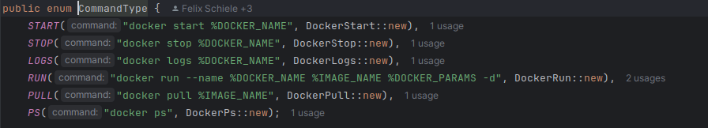

# Refactoring 
Dieses Dokument dokumentiert alle relevanten Informationen zu den verschiedenen Umgestaltungen im Code unseres Babyport-Projekts. Dies soll zum Verständnis der Gründe und der vorgenommenen Änderungen beitragen.

## 1. Refactoring (Verbesserung der DockerCommand Struktur) [BabyPort-Agent]
Bei diesem Refactoring wollten wir das DockerCommand und alle zugehörigen Klassen neu gestalten, da die Implementierung die Entwicklung des BabyPort-Agent behinderte. Außerdem konnten wir mit der aktuellen Implementierung unsere Qualitätsanforderungen nicht erfüllen.
### IST-Zustand
Der Code ist derzeit wie folgt strukturiert: Es gibt eine DockerCommand-Klasse, von der alle konkreten DockerCommands erben. Nur die DockerCommand Klasse implementiert ein Interface, das eine Methode hat, mit der der Command auf der Commandline ausgeführt wird. Jeder konkrete DockerCommand wird über einen CommandController ausgeführt, es lassen sich konkrete DockerCommand der CommandController Klassen hinzufügen. 

### Probleme
Die ursprüngliche Implementierung wies einige wesentliche Probleme auf, die im Rahmen eines Code-Refactorings behoben werden sollten:

Die generische Erstellung spezifischer Docker-Befehle führte zu Code-Duplizierung und Kontrollflussproblemen, insbesondere wenn von der einheitlichen Implementierung abgewichen wurde. Diese Struktur erschwerte nicht nur die Wartung des Codes, sondern führte auch zu Schwierigkeiten bei der Sicherstellung unserer Qualitätsstandards. Insbesondere das Testen des Codes stellte eine große Herausforderung dar. Die Prozessausführung innerhalb der konkreten Implementierung machte es nahezu unmöglich, diesen Teil des Codes durch Unit- und Integrationstests abzudecken.

Darüber hinaus entsprach die Implementierung nicht den SOLID-Prinzipien, insbesondere nicht dem Open-Closed-Prinzip, das wir zuvor als Qualitätsanforderung definiert hatten. Die DockerCommand-Klasse musste geändert werden, wenn sich die konkrete Implementierung eines Docker-Befehls änderte, was das Open-Closed-Prinzip verletzt.

### Gewünschter Zustand
Das anstehende Refactoring zielt darauf ab, mehrere Schlüsselaspekte der aktuellen Implementierung zu verbessern:

Erstens ist es entscheidend, dass der Code testbar wird, um sicherzustellen, dass er unseren Qualitätsstandards entspricht. Durch eine verbesserte Testbarkeit können wir Fehler schneller identifizieren und die Stabilität des Systems gewährleisten.

Darüber hinaus streben wir an, den Code so zu gestalten, dass er unseren definierten Qualitätsstandards, insbesondere den SOLID-Prinzipien, entspricht. Dies bedeutet, dass der Code klar strukturiert, wartbar und erweiterbar sein sollte, um den langfristigen Anforderungen des Projekts gerecht zu werden.

Ein weiteres Ziel des Refactorings ist die Entkopplung der DockerCommand Klasse von konkreten Implementierungen. Dies ermöglicht eine flexiblere und wartungsfreundlichere Architektur, in der Änderungen oder Erweiterungen an einem Docker-Befehl nicht zwangsläufig zu Änderungen an anderen Teilen des Codes führen. Durch diese Unabhängigkeit können wir eine bessere Modularität und Wiederverwendbarkeit erreichen.

### Konkrete Lösung
Die Lösung für die Schwächen der ursprünglichen Implementierung umfasst eine Reihe von Maßnahmen, die im Rahmen des Refactorings umgesetzt wurden:

Um die Ausführung der Commandline von der DockerCommand-Klasse zu entkoppeln, wurde entschieden, statt der direkten Prozesserstellung einen Prozessbuilder in die Ausführungslogik zu integrieren. Diese Entscheidung ermöglicht es, die Ausführung auf der Kommandozeile von der konkreten Implementierung der DockerCommand-Klasse zu abstrahieren. Dadurch wird es möglich, die einzelnen Elemente der DockerCommand-Klasse durch gezielte Tests zu erreichen und somit eine verbesserte Testabdeckung zu gewährleisten.

Eine weitere entscheidende Maßnahme war die Einführung des Strategy Design Patterns, um die Ausführungslogik der konkreten DockerCommands zu abstrahieren. Durch die Verwendung dieses Patterns kann jeder spezifische Docker-Befehl entweder die Standardimplementierung der Strategie verwenden oder eine eigene Implementierung wählen. Dies ermöglicht eine hohe Flexibilität und erleichtert die Wartung des Codes erheblich. Insbesondere minimiert die Verwendung der Strategie unnötige Code-Duplizierung, da die meisten Docker-Befehle die Standardimplementierung verwenden können.

Darüber hinaus verbessert die Verwendung des Strategie-Pattern die Testbarkeit der einzelnen Implementierungen, da diese unabhängig von anderen Komponenten getestet werden können. Dies fördert eine modulare und erweiterbare Architektur, in der Änderungen an einem Docker-Befehl keine Auswirkungen auf andere Teile des Systems haben.

Insgesamt stellt diese Lösung sicher, dass die Qualität und Testbarkeit des Codes verbessert wird, während gleichzeitig die SOLID-Prinzipien eingehalten und die Abhängigkeiten zwischen den verschiedenen Komponenten reduziert werden.

<TBD UML Diagramm Agent>

## 2. Refactoring (Remove Reflections) [BabyPort-Agent]
Dieses Refactoring dient dazu, eine Konstruktur direkt über Objektreferenzen statt über Reflexionen zu erhalten.

### IST-Zustand
Über den CommandType Enum wurde der Klassentyp des konkreten DockerCommand ermittelt. Dieser Klassentyp wurde verwendet, um auf den Construct der Klasse zuzugreifen, so dass eine neue Instanz des Construct von Reflection erzeugt werden konnte.

### Probleme
Die Reflexionen erforderten die Behandlung von Ausnahmen (6 Ausnahmen), was zu unnötigem Code führte. Außerdem wurde die Testbarkeit durch diese Logik eingeschränkt. Außerdem war diese Implementierung keine gute Kapselung der Logik.

### Gewünschter Zustand
Ziel des Refactorings ist es, unnötige Ausnahmebehandlungen im Code zu vermeiden. Dadurch wird die Testbarkeit verbessert, da weniger unvorhergesehene Fehlerbehandlungen die Testergebnisse verfälschen können. Außerdem soll eine bessere Kapselung der Logik erreicht werden, um den Kohäsion der verschiedenen Codebereiche zu verbessern und eine klarere Struktur zu schaffen.

### Konkrete Lösung
Ersetzen der Klassenreferenz im CommandType durch eine Konstrukturreferenz, wodurch der konkrete DockerCommand ohne Klassenreferenz erzeugt und direkt verwendet werden kann.

Code vor dem Refactoring

Code nach dem Refactoring

CommandController Vorher - Nachher:

