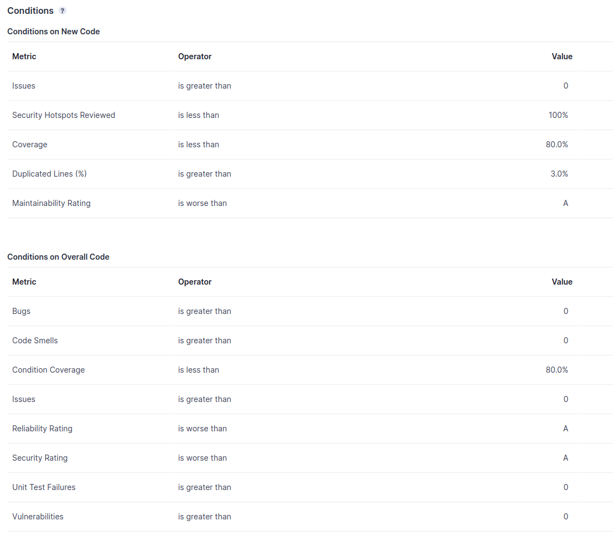

# Testplan

## Welche Arten von Tests werden eingesetzt?

Die aktuelle Teststruktur sieht vollautomatisierte Unit- und Integrationstests vor. Zusätzlich werden manuelle End-to-End-Tests sowie API-Tests für die MQTT-Anbindung durchgeführt.

## Was ist der Zielwert für die Testabdeckung?

Unser fester Zielwert für die Testabdeckung in Bezug auf die Coverage ist **80%** aller Zeilen.

Zusätzlich haben wir weitere Metriken, die über die Testabdeckung hinausgehen, um die Qualität unserer Software zu überprüfen. Das Quality Gate unterscheidet zwischen New Code und All Code. Für New Code verwenden wir die Einstellung, dass jeder neue Push in GitLab als New Code analysiert wird. Dies hat den Hintergrund, dass bei jeder gepushten Codeänderung die Qualitätsanforderungen eingehalten werden sollen.

Die folgenden Metriken sind Teil unseres Quality Gates und müssen von unserer Software erfüllt werden: 

## Welche automatischen Testwerkzeug werden genutzt?

- SonarQube (statische Code-Analyse)
- JUnit Jupiter 5 mit JUnit Params zur Parametrisierung
- Mockito
- Jacoco (Coverage Report in **XML**)

## Wie werden Testfälle verwaltet?

Alle Testfälle werden vollautomatisch über eine CI/CD Pipeline ausgeführt, so dass nachvollzogen werden kann, welcher Testfall in welcher Codeversion fehlgeschlagen ist und warum. Die Testausführung in der Pipeline ist in mehrere Schritte unterteilt. Zuerst werden alle Unit-Tests ausgeführt, danach alle Integrationstests. Für den Code Coverage Report mit Jacoco werden Unit- und Integrationstests zusammen ausgeführt.

Hier ein Beispiel für die Nachvollziehbarkeit, wenn ein Test fehlschlägt:

---

## Test Konventionen

- Unit-Test-Klassen folgen der folgenden Konvention: 
  - **\<Klassenname>Test.java**
- Integration-Test-Klassen folgen der folgenden Konvention:
  - **\<Klassenname>IT.java**
- Einzelne Test-Cases folgen der folgenden Konvention:
  - Testnamen: **\<Action>Should\<Expected Result>**
    - z. B.: **dockerStateOnInitShouldBeCreated**
  - Keine statischen Imports
    - z.B.: anstelle von
      -  Statisch: **when(command.noErrorOccurred()).thenReturn(false);** 
      -  Nicht statisch: **Mockito.when(command.noErrorOccurred()).thenReturn(false);**
    - Dies erhöht die Lesbarkeit und Wartbarkeit
  - Tests-Cases ab **15** Zeilen sollen zur besseren Lesbarkeit und Wartbarkeit unterteilt werden: 
    - Setup - Aufsetzen der Variablen
    - Action - Ausführen der notwendigen Aktionen
    - Assertion - Überprüfung des erwartetem Status der Applikation
  
