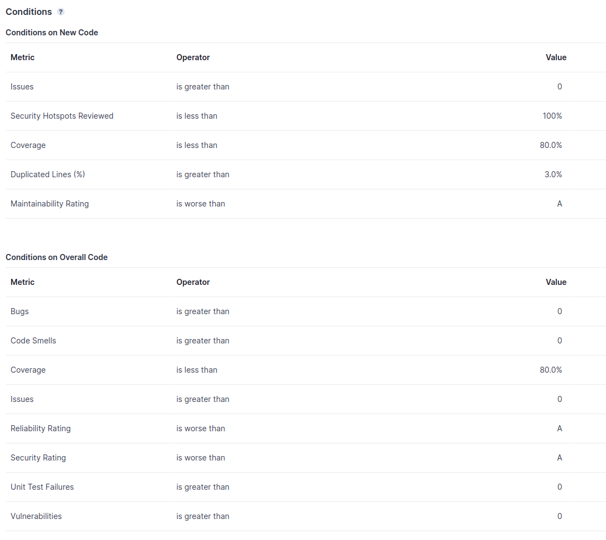

# Testplan

In diesem Dokument sind alle relevanten Informationen der Tests für das Projekt BabyPort zuammengefasst. Dabei werden alle relevanten Testarten, ihre Automatierung, Auswertung, Verwaltung, Metriken, Tools und Konventionen behandelt.

## Welche Arten von Tests werden eingesetzt?

Die aktuelle Teststruktur sieht vollautomatisierte Unit- und Integrationstests vor. Zusätzlich werden manuelle E2E (End-to-End)-Tests sowie API-Tests für die MQTT-Anbindung durchgeführt. Zum besseren Verständnis der genannten Testarten folgen deren Definitionen. Unit- und Integrationstests werden nach der Definition von [Fowler](https://martinfowler.com/articles/practical-test-pyramid.html) durchgeführt, der sich auf eine der bekanntesten Publikationen, [The Test Pyramid von Mike John](https://www.mountaingoatsoftware.com/blog/the-forgotten-layer-of-the-test-automation-pyramid), bezieht.

### Unit-Tests
Unit-Tests stellen sicher, dass eine bestimmte ``Unit`` der Codebasis wie erwartet funktioniert. Je nach Programmiersprache und -paradigma kann sich die Definition einer ``Unit`` unterscheiden. Für unser Projekt im Rahmen der objektorientierten Programmiersprache Java bedeutet ``Unit`` ein logischer Zusammenschluss von Methoden einer Klasse bis hin zu einer ganzen Klasse. 

### Integration-Tests
Integration-Tests beziehen sich nicht wie Unit-Tests auf mehrere logisch zusammenhängende Methoden, sondern testen mehrere Codekomponenten und stellen deren korrekte Zusammenarbeit sicher. Im Rahmen dieses Projekts bedeutet dies in der Regel, dass mehrere Klassen aus mehrere Java Packages getestet werden.

---

Neben diesen beiden Testarten, die automatisiert durchgeführt werden, kommen auch manuelle E2E- und API-Tests zum Einsatz. Ziel dieser ist es, große Teile der Anwendung in Kombination aus Server-Client und Agent, zu testen. 

Bei E2E-Tests werden per Button-Clicks über die Swing UI Events ausgelöst, die über die MQTT-Schnittstelle und den Broker an den Agent weitergeleitet werden. Der Agent führt je nach Anfrage die passenden Docker-Befehle aus. Dabei werden auch Events vom Agent zurück an den Server-Client gesendet. Um diese E2E-Tests manuell durchzuführen, muss zunächst ein lokaler [MQTT-Broker](https://mosquitto.org/) gestartet werden, bei dem sich im Anschluss sowohl Agent als auch ServerClient beim Start verbinden.

Manuelle API-Tests verfolgen ein ähnliches Ziel wie die E2E-Tests, jedoch muss dafür in der Regel nur eine Anwendung, Server-Client oder Agent, gestartet und damit getestet werden. Der Fokus liegt darauf, dass bei ausgelösten Eingaben, die gewünschten Ergebnisse über MQTT gesendet oder die richtigen Docker-Befehle ausgeführt werden. 

## Was ist der Zielwert für die Testabdeckung?

Unser fester Zielwert für die Testabdeckung in Bezug auf die Coverage ist **80%** aller Zeilen.

Zusätzlich haben wir weitere Metriken, die über die Testabdeckung hinausgehen, um die Qualität unserer Software zu überprüfen. Das Quality Gate unterscheidet zwischen New Code und All Code. Für New Code verwenden wir die Einstellung, dass jeder neue Push in GitLab als New Code analysiert wird. Dies hat den Hintergrund, dass bei jeder gepushten Codeänderung die Qualitätsanforderungen eingehalten werden sollen.

Die folgenden Metriken sind Teil unseres Quality Gates und müssen von unserer Software erfüllt werden: 

## Welche automatischen Testwerkzeug werden genutzt?

- SonarQube (statische Code-Analyse)
- JUnit Jupiter 5 mit JUnit Params zur Parametrisierung
- Mockito
- Jacoco (Coverage Report in **XML**)

## Wie werden Testfälle verwaltet?

Alle Testfälle werden vollautomatisch über eine CI/CD Pipeline ausgeführt, so dass nachvollzogen werden kann, welcher Testfall in welcher Codeversion fehlgeschlagen ist und warum. Die Testausführung in der Pipeline ist in mehrere Schritte unterteilt. Zuerst werden alle Unit-Tests ausgeführt, danach alle Integrationstests. Für den Code Coverage Report mit Jacoco werden Unit- und Integrationstests zusammen ausgeführt.

Hier ein Beispiel für die Nachvollziehbarkeit, wenn ein Test fehlschlägt:

---

## Test Konventionen

- Unit-Test-Klassen folgen der folgenden Konvention: 
  - **\<Klassenname>Test.java**
- Integration-Test-Klassen folgen der folgenden Konvention:
  - **\<Klassenname>IT.java**
- Einzelne Test-Cases folgen der folgenden Konvention:
  - Testnamen: **\<Action>Should\<Expected Result>**
    - z. B.: **dockerStateOnInitShouldBeCreated**
    - Tests die Exceptions testen: **\<Action>ShouldThrow\<Expected Exception Name>Exception**
    - Generell folgen die Testnamen der Java üblichen **Camel Case** Namenskonvention für Methoden
  - Mindestens ein ``assert`` pro Testmethode
  - Keine statischen Importe, da wir nicht davon ausgehen wollen, dass alle Personen, die jemals am Projekt arbeiten werden, alle Frameworks genau kennen. Durch die Vermeidung von statischen Imports wird die Lesbarkeit für diese Personengruppen verbessert und somit das Onboarding erleichtert. 
    - z.B.: anstelle von
      -  Statisch: **when(command.noErrorOccurred()).thenReturn(false);** 
      -  Nicht statisch: **Mockito.when(command.noErrorOccurred()).thenReturn(false);**
    - Dies erhöht die Lesbarkeit und Wartbarkeit
  - Tests-Cases ab **15** Zeilen sollen zur besseren Lesbarkeit und Wartbarkeit unterteilt werden: 
    - Setup - Aufsetzen der Variablen
    - Action - Ausführen der notwendigen Aktionen
    - Assertion - Überprüfung des erwartetem Status der Applikation
  